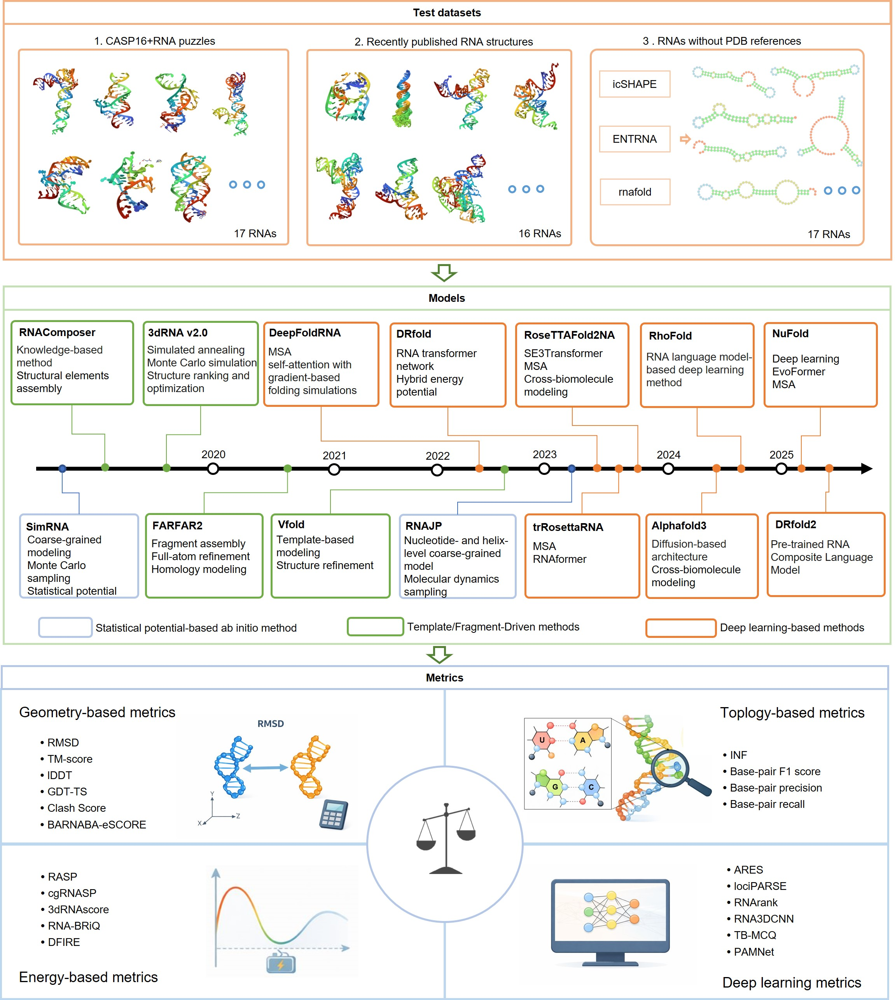

# Benchmarking RNA Tertiary Structure Prediction Models and Evaluation Metrics

This repository contains code and example data accompanying:

> **Benchmarking RNA tertiary structure prediction models and evaluation metrics**  
> (manuscript)

We provide a **reproducible pipeline** for:
- processing RNA 3D structures into benchmark-ready datasets,
- running **14 publicly available RNA tertiary structure prediction methods**, and
- evaluating predictions using **21 complementary structural metrics**  
  (geometry, topology, energy-based, and deep-learning–based scores),

as well as scripts to reproduce the **main figures** in the manuscript.

---

## 1. Overview

The goal of this project is to offer a **transparent, reproducible benchmark** of modern RNA 3D structure prediction tools and evaluation metrics.

We:
- Construct **three curated datasets**:
  - **Dataset1** – 17 high-resolution RNAs from CASP16 & RNA-Puzzles  
  - **Dataset2** – 16 **temporally independent** RNAs (post-publication hold-out)  
  - **Dataset3** – 17 **reference-free** human/mouse RNAs enriched for stable tertiary folds
- Benchmark **14 prediction methods** spanning:
  - statistical potential–based / ab initio,
  - template / fragment-driven, and
  - deep learning–based models.
- Evaluate predictions using **21 metrics**, grouped into:
  - geometry-based,
  - topology-based,
  - energy-based, and
  - deep learning–based evaluation metrics.
- Provide **plotting scripts** to reproduce figures (e.g. performance violin plots, radar plots, PCA/clustering of metrics, ROC curves).

This repository hosts:
- **Data preprocessing scripts**  
- **Example benchmark data**  
- **Plotting code** for Figures 1–7

---

## 2. Repository structure

A suggested structure (adjust to match your repo):

```text
.
├── data/
│   ├── dataset1/                  # Processed structures / metadata for Dataset1
│   ├── dataset2/                  # Processed structures / metadata for Dataset2
│   ├── dataset3/                  # Processed sequences & filters for Dataset3
│   ├── metrics/                   # Precomputed metric tables (CSV/TSV)
│   └── examples/                  # Small example subset for quick tests
├── scripts/
│   ├── 01_preprocess_structures.py
│   ├── 02_run_predictors.sh       # Example wrapper to run external methods
│   ├── 03_compute_metrics.py      # Calls RNAdvisor / RNA_assessment / etc.
│   └── utils/                     # Helper functions (I/O, plotting helpers…)
├── plot/
│   ├── figure1_overview.R
│   ├── figure2_model_performance.R
│   ├── figure3_temporal_holdout.R
│   ├── figure4_reference_free.R
│   ├── figure5_sequence_factors.R
│   ├── figure6_metric_PCA_clustering.R
│   └── figure7_metric_comparison_ROC.R
├── env/
│   ├── environment.yml            # Conda env for Python tools (optional)
│   └── renv/ or requirements_R.txt  # R package environment (optional)
└── README.md

```

---
## 3. Data

### 3.1 Datasets Overview

We constructed **three curated RNA structure datasets** with distinct design principles to provide comprehensive and unbiased evaluation:

| Dataset | Design Purpose | Size | Length Range | Source | Key Features |
|---------|----------------|------|--------------|--------|--------------|
| **Dataset1** | Standard benchmark for well-folded RNAs | 17 RNAs | 37-134 nt | CASP16 & RNA-Puzzles | High-resolution (1.55-3.04 Å) canonical structures |
| **Dataset2** | Temporal hold-out test for generalization | 16 RNAs | 17-277 nt | Post-publication structures | Strictly post-dates model publication dates |
| **Dataset3** | Reference-free ab initio evaluation | 17 RNAs | - | Human/mouse transcriptome | No experimental 3D structures available |

### 3.2 Dataset Details

#### **Dataset1: High-Resolution Canonical RNAs**
- **Source**: CASP16 competition and RNA-Puzzles initiative
- **Selection criteria**: 
  - Experimentally resolved, well-folded RNAs
  - High-quality reference structures (1.55-3.04 Å resolution)
  - Diverse structural classes including viral elements, ribozymes, and tRNAs
- **Purpose**: Standard benchmark representing the "gold standard" in RNA structural biology

#### **Dataset2: Temporal Hold-Out RNAs**
- **Construction principle**: All structures were released **strictly after** the publication date of each corresponding prediction model
- **Data leakage prevention**: Ensures models cannot have been trained on these structures
- **Structural diversity**: Includes RNAs with varying resolution (2.4-8.57 Å) and complexity
- **Purpose**: Unbiased test of model generalization capability to novel RNA folds

#### **Dataset3: Reference-Free Ab Initio RNAs**
- **Source**: Human and mouse transcriptomes
- **Selection methodology**: Multi-criteria filtering to enrich for stable tertiary folds:
  1. **icSHAPE reactivity profiles** – identifies structured regions
  2. **ENTRNA foldability scores** – predicts RNA foldability
  3. **RNAfold energy predictions** – estimates thermodynamic stability
- **Unique feature**: No experimentally determined 3D structures exist for any RNA in this dataset
- **Purpose**: Evaluation of prediction methods and scoring functions in purely ab initio contexts


---
## 4. RNA 3D Structure Prediction Models

### 4.1 Overview of Evaluated Methods

We benchmarked **14 representative RNA tertiary structure prediction models** spanning three major methodological categories:

| Category | Models Included | Core Methodology | Key Features |
|----------|-----------------|------------------|--------------|
| **Statistical Potential & Ab Initio** | SimRNA, 3dRNA v2.0, FARFAR2, VFold | Coarse-grained sampling, fragment assembly, statistical potentials | Physics-inspired, template-free conformational exploration |
| **Template/Fragment-Driven** | RNAComposer, RNAJP, trRosettaRNA | Structural database integration, MSA coevolution, fragment libraries | Knowledge-guided construction using evolutionary signals |
| **Deep Learning-Based** | DRfold, RhoFold, RoseTTAFold2NA, DeepFoldRNA, AlphaFold3 | RNA transformers, cross-modal architectures, EvoFormer modules | Neural network prediction of complex long-range interactions |

### 4.2 Model Details

#### **4.2.1 Statistical Potential & Ab Initio Methods**
- **[SimRNA](https://genesilico.pl/SimRNAweb/)** – Coarse-grained Monte Carlo sampling with statistical potential for template-free conformational exploration.
- **[RNAJP](http://rna.physics.missouri.edu/vfold_software_download/RNAJP_download.html)** – Junction-based modeling approach employing fragment libraries for RNA 3D structure prediction.

#### **4.2.2 Template & Fragment-Driven Methods**
- **[RNAComposer](https://rnacomposer.cs.put.poznan.pl)** – Template-based modeling system utilizing the RNA FRABASE database for automated structure construction.
- **[3dRNA v2.0](http://biophy.hust.edu.cn/new/3dRNA)** – Fragment assembly approach with knowledge-based scoring function for RNA structure prediction.
- **[FARFAR2](https://github.com/RosettaCommons/rosetta.git)** – Fragment assembly of RNA using the Rosetta energy function and conformational sampling.
- **[VFold](https://rna.physics.missouri.edu/vfoldPipeline/)** – V-fold model combining statistical potentials and fragment libraries for 3D structure prediction.

#### **4.2.3 Deep Learning-Based Methods**
- **[trRosettaRNA](https://yanglab.qd.sdu.edu.cn/trRosettaRNA/)** – Integrates deep learning-predicted distance/orientation restraints with fragment assembly for structure generation.
- **[DRfold](https://github.com/leeyang/DRfold.git)** – End-to-end deep learning framework with hybrid energy network for direct RNA structure prediction.
- **[DRfold2](https://github.com/leeyang/DRfold2.git)** – DRfold2 is a deep learning method for RNA structure prediction. At its core, DRfold2 utilizes the RNA Composite Language Model (RCLM), which provides enhanced full likelihood approximation capabilities to effectively capture co-evolutionary signals from unsupervised sequence data.
- **[RhoFold](https://github.com/ml4bio/RhoFold.git)** – RNA transformer architecture incorporating geometric constraints for accurate structure modeling.
- **[RoseTTAFold2NA](https://github.com/uw-ipd/RoseTTAFold2NA.git)** – Three-track neural network architecture specifically designed for nucleic acid structure prediction.
- **[DeepFoldRNA](https://github.com/robpearc/DeepFoldRNA.git)** – Comprehensive deep learning framework for RNA tertiary structure prediction from sequence.
- **[AlphaFold3](https://alphafoldserver.com/)** – Generalized architecture for biomolecular structure prediction, including RNA modeling capabilities.
- **[NuFold](https://github.com/kiharalab/NuFold.git)** – NuFold is a state-of-the-art method designed for predicting 3D RNA structures, leveraging deep learning for high accuracy and reliability. This tool is particularly useful for biologists and bioinformatics researchers focusing on RNA function and structure. 

---
## 5. Evaluation Metrics

### 5.1 Overview of Evaluation Framework

We employed **21 complementary metrics** spanning four major methodological categories:

| Category | Metrics Included | Evaluation Focus | Key Characteristics |
|----------|-----------------|------------------|---------------------|
| **Geometry-Based** | RMSD, TM-score, lDDT, GDT-TS, Clash score, BARBABA-eSCORE | Atomic coordinate similarity | Quantify global and local structural deviations |
| **Topology-Based** | INF, Base-pair F1 score, Precision, Recall | Base-pairing pattern correctness | Assess secondary structure and contact map accuracy |
| **Energy-Based** | RASP, cgRNASP, 3dRNAscore, RNA-BRIQ, DFIRE | Structural plausibility and stability | Statistical/knowledge-based potentials from experimental structures |
| **Deep Learning-Based** | ARES, RNAalign, RNARank, RNA3DCNN, TB-MQC, PAMNet | Neural network discrimination | Learned representations for native vs. decoy classification |

### 5.2 Metric Details

#### **5.2.1 Geometry-Based Metrics**
- **[RMSD/TM-score/lDDT/GDT-TS](https://zhanggroup.org/TM-score/)** – Standard structural similarity measures including Root Mean Square Deviation, Template Modeling score, local Distance Difference Test, and Global Distance Test.
- **[Clash score](http://molprobity.biochem.duke.edu/)** – Evaluates structural plausibility by counting steric clashes in predicted models.
- **[BARBABA-eSCORE](https://github.com/barbabamolnar/barbaba)** – Ensemble-based scoring method for assessing RNA structure quality and native-likeness.

#### **5.2.2 Topology-Based Metrics**
- **[INF](https://doi.org/10.1093/nar/gkab1145)** – Interaction Network Fidelity metric measuring correctness of predicted base-pair interactions and contact maps.
- **Base-pair F1 score/Precision/Recall** – Standard classification metrics for evaluating base-pair prediction accuracy using tools like RNAView and MC-Annotate.

#### **5.2.3 Energy-Based Metrics**
- **[RASP](https://github.com/Tan-group/RASP)** – RNA Assessment of Structures Package providing knowledge-based potentials for RNA structure evaluation.
- **[cgRNASP](https://doi.org/10.1093/nar/gkab1186)** – Coarse-grained statistical potential specifically designed for RNA structure assessment.
- **[3dRNAscore](http://biophy.hust.edu.cn/3dRNA/score.html)** – Scoring function optimized for RNA tertiary structures incorporating multiple structural features.
- **[RNA-BRIQ](https://github.com/RNA-FoldingLab/RNA-BRIQ)** – Bayesian model for RNA structure quality assessment using reference-free evaluation principles.
- **[DFIRE](http://sparks-lab.org/yueyang/DFIRE/RNA-seq/)** – Distance-scaled Finite Ideal-gas Reference potential for statistical evaluation of RNA structures.

#### **5.2.4 Deep Learning-Based Metrics**
- **[ARES](https://github.com/ahsenm/ARES)** – Atomic Rotationally Equivariant Scorer employing geometric deep learning for RNA structure assessment.
- **[RNAalign](https://github.com/s2001/RNAalign)** – Deep learning model for RNA structure alignment and quality scoring using learned representations.
- **[RNARank](https://doi.org/10.1093/bioinformatics/btab678)** – Neural network framework for ranking RNA structural models based on quality predictions.
- **[RNA3DCNN](https://github.com/lyangmd/RNA3DCNN)** – 3D convolutional neural network architecture for comprehensive RNA structure assessment.
- **[TB-MQC](https://doi.org/10.1093/nar/gkab493)** – Template-based Model Quality Assessment method leveraging structural similarities for scoring.
- **[PAMNet](https://github.com/kad-ecoli/PAMNet)** – Point Attention Network for RNA structure evaluation using attention mechanisms on point cloud representations.


