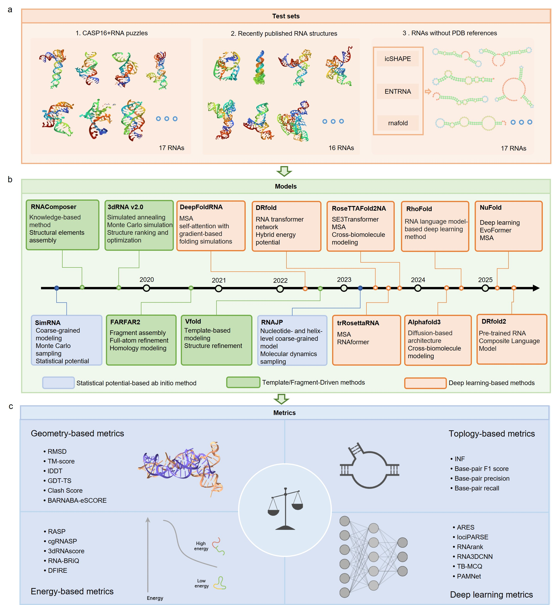

# Benchmarking RNA Tertiary Structure Prediction Models and Evaluation Metrics

This repository contains code and example data accompanying:

> **Benchmarking RNA tertiary structure prediction models and evaluation metrics**  
> You Wu, Xiang Li, Dongke Zhou, Pengfei Xu, Xiang Yu  
> (manuscript)

We provide a **reproducible pipeline** for:
- processing RNA 3D structures into benchmark-ready datasets,
- running **14 publicly available RNA tertiary structure prediction methods**, and
- evaluating predictions using **21 complementary structural metrics**  
  (geometry, topology, energy-based, and deep-learning–based scores),

as well as scripts to reproduce the **main figures** in the manuscript.

---

## 1. Overview

The goal of this project is to offer a **transparent, reproducible benchmark** of modern RNA 3D structure prediction tools and evaluation metrics.

We:
- Construct **three curated datasets**:
  - **Dataset1** – 17 high-resolution RNAs from CASP16 & RNA-Puzzles  
  - **Dataset2** – 16 **temporally independent** RNAs (post-publication hold-out)  
  - **Dataset3** – 17 **reference-free** human/mouse RNAs enriched for stable tertiary folds
- Benchmark **14 prediction methods** spanning:
  - statistical potential–based / ab initio,
  - template / fragment-driven, and
  - deep learning–based models.
- Evaluate predictions using **21 metrics**, grouped into:
  - geometry-based,
  - topology-based,
  - energy-based, and
  - deep learning–based evaluation metrics.
- Provide **plotting scripts** to reproduce figures (e.g. performance violin plots, radar plots, PCA/clustering of metrics, ROC curves).

This repository hosts:
- **Data preprocessing scripts**  
- **Example benchmark data**  
- **Plotting code** for Figures 1–7

---

## 2. Repository structure

A suggested structure (adjust to match your repo):

```text
.
├── data/
│   ├── dataset1/                  # Processed structures / metadata for Dataset1
│   ├── dataset2/                  # Processed structures / metadata for Dataset2
│   ├── dataset3/                  # Processed sequences & filters for Dataset3
│   ├── metrics/                   # Precomputed metric tables (CSV/TSV)
│   └── examples/                  # Small example subset for quick tests
├── scripts/
│   ├── 01_preprocess_structures.py
│   ├── 02_run_predictors.sh       # Example wrapper to run external methods
│   ├── 03_compute_metrics.py      # Calls RNAdvisor / RNA_assessment / etc.
│   └── utils/                     # Helper functions (I/O, plotting helpers…)
├── plot/
│   ├── figure1_overview.R
│   ├── figure2_model_performance.R
│   ├── figure3_temporal_holdout.R
│   ├── figure4_reference_free.R
│   ├── figure5_sequence_factors.R
│   ├── figure6_metric_PCA_clustering.R
│   └── figure7_metric_comparison_ROC.R
├── env/
│   ├── environment.yml            # Conda env for Python tools (optional)
│   └── renv/ or requirements_R.txt  # R package environment (optional)
└── README.md

```

---
## 3. Data

### 3.1 Datasets Overview

We constructed **three curated RNA structure datasets** with distinct design principles to provide comprehensive and unbiased evaluation:

| Dataset | Design Purpose | Size | Length Range | Source | Key Features |
|---------|----------------|------|--------------|--------|--------------|
| **Dataset1** | Standard benchmark for well-folded RNAs | 17 RNAs | 37-134 nt | CASP16 & RNA-Puzzles | High-resolution (1.55-3.04 Å) canonical structures |
| **Dataset2** | Temporal hold-out test for generalization | 16 RNAs | 17-277 nt | Post-publication structures | Strictly post-dates model publication dates |
| **Dataset3** | Reference-free ab initio evaluation | 17 RNAs | - | Human/mouse transcriptome | No experimental 3D structures available |

### 3.2 Dataset Details

#### **Dataset1: High-Resolution Canonical RNAs**
- **Source**: CASP16 competition and RNA-Puzzles initiative
- **Selection criteria**: 
  - Experimentally resolved, well-folded RNAs
  - High-quality reference structures (1.55-3.04 Å resolution)
  - Diverse structural classes including viral elements, ribozymes, and tRNAs
- **Purpose**: Standard benchmark representing the "gold standard" in RNA structural biology

#### **Dataset2: Temporal Hold-Out RNAs**
- **Construction principle**: All structures were released **strictly after** the publication date of each corresponding prediction model
- **Data leakage prevention**: Ensures models cannot have been trained on these structures
- **Structural diversity**: Includes RNAs with varying resolution (2.4-8.57 Å) and complexity
- **Purpose**: Unbiased test of model generalization capability to novel RNA folds

#### **Dataset3: Reference-Free Ab Initio RNAs**
- **Source**: Human and mouse transcriptomes
- **Selection methodology**: Multi-criteria filtering to enrich for stable tertiary folds:
  1. **icSHAPE reactivity profiles** – identifies structured regions
  2. **ENTRNA foldability scores** – predicts RNA foldability
  3. **RNAfold energy predictions** – estimates thermodynamic stability
- **Unique feature**: No experimentally determined 3D structures exist for any RNA in this dataset
- **Purpose**: Evaluation of prediction methods and scoring functions in purely ab initio contexts


---
## 4. Models

### 4.1 Overview of Evaluated Methods

We benchmarked **14 representative RNA tertiary structure prediction models** spanning three major methodological categories, covering the full evolution of RNA structure prediction from classical approaches to state-of-the-art deep learning frameworks:

| Category | Models Included | Core Methodology | Key Features |
|----------|-----------------|------------------|--------------|
| **Statistical Potential & Ab Initio** | SimRNA, 3dRNA v2.0, FARFAR2, VFold | Coarse-grained sampling, fragment assembly, statistical potentials | Physics-inspired, template-free conformational exploration |
| **Template/Fragment-Driven** | RNAComposer, RNAJP, trRosettaRNA | Structural database integration, MSA coevolution, fragment libraries | Knowledge-guided construction using evolutionary signals |
| **Deep Learning-Based** | DRfold, RhoFold, RoseTTAFold2NA, DeepFoldRNA, AlphaFold3 | RNA transformers, cross-modal architectures, EvoFormer modules | Neural network prediction of complex long-range interactions |

### 4.2 Model Categories in Detail

#### **4.2.1 Statistical Potential & Ab Initio Methods**
*Classical approaches relying on physical principles and conformational sampling*

- **SimRNA** – Coarse-grained Monte Carlo sampling with statistical potential
- **3dRNA v2.0** – Fragment assembly with knowledge-based scoring function  
- **FARFAR2** – Fragment assembly of RNA with Rosetta energy function
- **VFold** – V-fold model for RNA 3D structure prediction

**Characteristics**: Template-free, explore RNA folding landscapes through conformational sampling, suitable for novel folds without homologs.

#### **4.2.2 Template & Fragment-Driven Methods**
*Knowledge-based approaches leveraging existing structural information*

- **RNAComposer** – Template-based modeling using RNA FRABASE database
- **RNAJP** – Junction-based modeling with fragment libraries
- **trRosettaRNA** – Deep learning-predicted distance/orientation restraints + fragment assembly

**Characteristics**: Integrate structural databases, multiple sequence alignment (MSA) derived coevolution signals, or fragment libraries to guide model construction.

#### **4.2.3 Deep Learning-Based Methods**  
*Next-generation neural architectures for RNA structure prediction*

- **DRfold** – End-to-end deep learning with hybrid energy network
- **RhoFold** – RNA transformer architecture with geometric constraints
- **RoseTTAFold2NA** – Three-track neural network for nucleic acids
- **DeepFoldRNA** – Deep learning framework for RNA 3D structure
- **AlphaFold3** – Generalized architecture for biomolecular structures (including RNA)

**Characteristics**: Leverage RNA transformers, cross-modal architectures, EvoFormer-style modules, or hybrid energy networks to capture complex long-range interactions and enhance folding accuracy.

### 4.3 Model Timeline and Evolution

The inclusion of models across all three categories highlights the **rapid methodological evolution** in RNA tertiary structure prediction:
- **Early era**: Physics-based and statistical potential methods (pre-2015)
- **Intermediate era**: Template/fragment approaches with evolutionary constraints (~2015-2020)
- **Modern era**: Deep learning revolution with end-to-end neural networks (2020-present)

This comprehensive selection provides insights into how methodological advances have translated to improved prediction accuracy across different RNA structural contexts.

### 4.4 Implementation and Usage

#### **Model Availability**
| Model | License | Source Code | Web Server |
|-------|---------|-------------|------------|
| SimRNA | Free for academic | GitHub | Available |
| 3dRNA v2.0 | Free for academic | GitHub | Available |
| FARFAR2 | Rosetta License | GitHub | Available |
| VFold | Free for academic | GitHub | Available |
| RNAComposer | Free | Web server only | Available |
| RNAJP | Free for academic | GitHub | Available |
| trRosettaRNA | MIT License | GitHub | Available |
| DRfold | Free for academic | GitHub | Available |
| RhoFold | Apache 2.0 | GitHub | Available |
| RoseTTAFold2NA | MIT License | GitHub | Available |
| DeepFoldRNA | MIT License | GitHub | Available |
| AlphaFold3 | Commercial/Academic | Limited access | Limited |

#### **Running Models in This Benchmark**
See `/scripts/02_run_predictors.sh` for example wrappers and execution scripts. Each model requires specific dependencies and parameter settings, which we have standardized across all evaluations.

### 4.5 Methodological Coverage

Together, these 14 models represent:
- **Full methodological spectrum** from early knowledge-based frameworks to next-generation neural architectures
- **Diverse algorithmic approaches** including Monte Carlo sampling, fragment assembly, template modeling, and end-to-end deep learning
- **Varying data requirements** from ab initio (no homologs needed) to methods requiring multiple sequence alignments
- **Different computational demands** ranging from minutes to days per prediction

This comprehensive selection enables systematic analysis of how methodological choices affect prediction performance across different RNA types and evaluation scenarios.


## 5. Metrics


